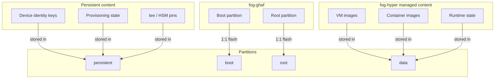
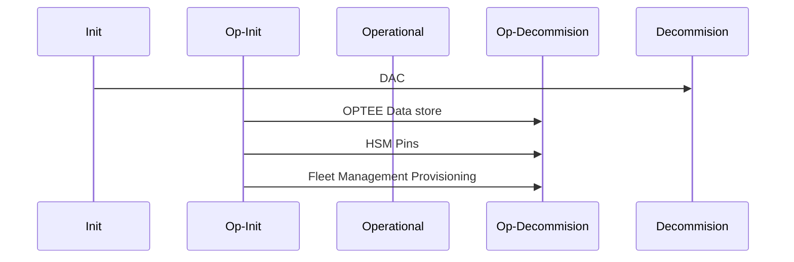

# Partition table in fog-ghaf

| Partition | Description           |
| --------- | -----------           |
| nvme0n1p1 | Persistent partition  |
| nvme0n1p2 | Boot partition        |
| nvme0n1p3 | OS partition          |
| nvme0n1p4 | Data partition        |



# Partition lifecycles


## Persistent partition table-of-contents


```shell
Persistent/
├── certificates/                         # DAC data store
│   ├── identity.pem
│   ├── ca.pem
│   └── dac.json
│
├── tee/                                  # OPTEE data store (Proposal)
│   ├── 0
│   ├── 1
│   ...
│   └── ff
│
├── hsm-pins/                             # HSM pins store (Proposal)
│
│       
└── provisioning-data/                    # Fleet management provisioning
    ├── subfolder1
    ├── ca-certificate.pem
    ├── client-certificate.pem
    ├── client-certificate-request.pem
    ├── client.key
    ├── device-registered.txt
    ├── nats-url.txt
    ├── .provisioning_done.flag
    ├── .registration_done.flag
    └── serial-number.txt

```

## Persistent data lifecycles


| Partition      | Description                                               |
| ---------      | -----------                                               |
| Init           | Device factory initialization                             |
| Op-Init        | Customer provisioning of device (Identity, certificates)  |
| Operational    | Operational state                                         |
| Op-Decommision | Revocation of customer identities and certificates        |
| Decommision    | Revocation of identities and data generated in init state |

